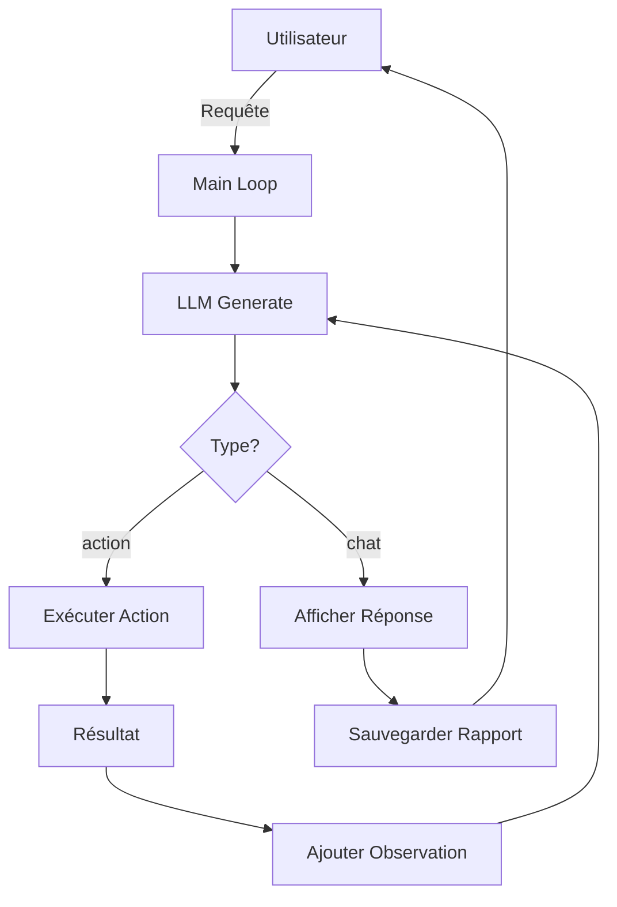

# 🤖 J.A.R.V.I.S - Just A Rather Very Intelligent System

[](https://www.python.org/)
[](https://ollama.com/)
[](LICENSE)

> *Un assistant IA personnel avancé inspiré de l'assistant de Tony Stark, capable de raisonnement complexe, d'actions autonomes et d'apprentissage continu.*

## 📋 Table des Matières

- [À Propos](#-à-propos)
- [Caractéristiques](#-caractéristiques)
- [Architecture](#-architecture)
- [Prérequis](#-prérequis)
- [Installation](#-installation)
- [Configuration](#-configuration)
- [Utilisation](#-utilisation)
- [Actions Disponibles](#-actions-disponibles)
- [Structure du Projet](#-structure-du-projet)
- [Fonctionnement du Système Agentique](#-fonctionnement-du-système-agentique)
- [Personnalisation](#-personnalisation)
- [Dépannage](#-dépannage)
- [Contribuer](#-contribuer)
- [Licence](#-licence)

## 🎯 À Propos

**J.A.R.V.I.S** est un assistant IA avancé qui fonctionne entièrement en local grâce à **Ollama**. Inspiré de l'assistant personnel de Tony Stark, ce système implémente une architecture agentique complète avec:

- 🧠 **Raisonnement multi-étapes** : Utilise une boucle agentique (ReAct pattern) pour des tâches complexes
- 🔧 **Actions autonomes** : Peut interagir avec votre système, le web, et les fichiers
- 💭 **Pensée visible** : Affiche son processus de réflexion interne
- 📝 **Mémoire conversationnelle** : Maintient le contexte de vos échanges
- 🎨 **Interface élégante** : Terminal riche avec formatage Markdown et couleurs

Le système suit un **pipeline cognitif** sophistiqué pour chaque requête utilisateur, analysant l'intention, planifiant les étapes, et exécutant les actions nécessaires de manière autonome.

## ✨ Caractéristiques

### 🤖 Intelligence Avancée

- **Modèle LLM Local** : Utilise Llama 3.1 8B via Ollama (personnalisable)
- **Raisonnement Complexe** : Jusqu'à 25 étapes de réflexion pour résoudre des problèmes complexes
- **Pattern ReAct** : Observation → Pensée → Action → Observation (boucle itérative)
- **Verbosité Élevée** : Répond avec des explications détaillées de type essai universitaire

### 🛠️ Actions Multiples

Le système dispose de 14+ actions réparties en 5 catégories:

- **Web** : Recherche Wikipedia, YouTube, Google
- **Système de Fichiers** : Lecture, écriture, listage de répertoires
- **Système** : Ouverture d'applications
- **Internet** : Recherche web DuckDuckGo, extraction de contenu web
- **Extensions** : Statistiques système, captures d'écran

### 🎨 Interface Utilisateur

- **Terminal Enrichi** : Utilise la bibliothèque `rich` pour une interface moderne
- **Visualisation des Pensées** : Affiche le processus de réflexion de l'IA
- **Indicateurs d'Actions** : Notifications visuelles lors de l'exécution d'actions
- **Support Markdown** : Rendu élégant des réponses formatées
- **Thème Personnalisé** : Couleurs inspirées de l'univers Iron Man (cyan/or)

### 📊 Rapports Automatiques

Chaque conversation est automatiquement sauvegardée dans le dossier `reports/` avec:
- Horodatage
- Extrait de la requête utilisateur
- Contenu complet de la réponse
- Format Markdown

## 🏗️ Architecture

Le projet suit une architecture modulaire claire:

```
jarvis/
├── main.py              # Point d'entrée et boucle agentique
├── config.py            # Configuration (modèle, API keys)
├── ui.py                # Interface utilisateur (Rich)
├── utils.py             # Utilitaires (parsing JSON)
├── system_prompt.txt    # Prompt système détaillé
├── requirements.txt     # Dépendances Python
├── llm/
│   └── engine.py        # Moteur LLM (Ollama)
├── actions/
│   ├── __init__.py      # Registre des outils
│   ├── web.py           # Actions web
│   ├── filesystem.py    # Actions fichiers
│   ├── system.py        # Actions système
│   ├── internet.py      # Actions internet
│   └── extended.py      # Actions étendues
└── reports/             # Rapports de conversation
```

### 🔄 Flux d'Exécution



## 🔧 Prérequis

### Logiciels Requis

- **Python 3.8+** : [Télécharger Python](https://www.python.org/downloads/)
- **Ollama** : [Installer Ollama](https://ollama.com/)
- **Git** (optionnel) : Pour cloner le dépôt

### Système d'Exploitation

- ✅ Windows 10/11
- ✅ macOS (10.15+)
- ✅ Linux (Ubuntu 20.04+, Debian, Fedora)

### Matériel Recommandé

- **RAM** : 8 Go minimum (16 Go recommandé)
- **Stockage** : 10 Go d'espace libre (pour les modèles)
- **Processeur** : CPU moderne multi-cœur
- **GPU** (optionnel) : NVIDIA pour accélération CUDA

## 📦 Installation

### 1. Cloner le Dépôt

```bash
git clone <URL_DU_DEPOT>
cd jarvis
```

### 2. Créer un Environnement Virtuel

```bash
# Windows
python -m venv venv
venv\Scripts\activate

# Linux/macOS
python3 -m venv venv
source venv/bin/activate
```

### 3. Installer les Dépendances

```bash
pip install -r requirements.txt
```

### 4. Installer Ollama

Si ce n'est pas déjà fait:

**Windows:**
```bash
# Télécharger depuis https://ollama.com/download/windows
# Ou via winget:
winget install Ollama.Ollama
```

**macOS:**
```bash
brew install ollama
```

**Linux:**
```bash
curl -fsSL https://ollama.com/install.sh | sh
```

### 5. Télécharger le Modèle LLM

```bash
ollama pull llama3.1:8b
```

*Note: Le système téléchargera automatiquement le modèle au premier lancement si absent.*

## ⚙️ Configuration

### Fichier `config.py`

Personnalisez le comportement de J.A.R.V.I.S:

```python
# Modèle LLM (voir 'ollama list' pour les modèles disponibles)
MODEL_ID = "llama3.1:8b"  # Options: llama3.1, codellama, mistral, etc.

# URL Ollama
OLLAMA_URL = "http://localhost:11434"

# Clés API (optionnelles)
GOOGLE_API_KEY = "votre_clé_api"      # Pour google_search()
GOOGLE_CSE_ID = "votre_cse_id"        # Pour google_search()
```

### Personnalisation du Prompt Système

Éditez `system_prompt.txt` pour modifier:
- La personnalité de l'assistant
- Le niveau de verbosité
- Les directives de comportement
- Le pipeline cognitif

## 🚀 Utilisation

### Lancement Standard

```bash
python main.py
```

### Mode Mock (Sans LLM)

Pour tester sans charger le modèle:

```bash
python main.py --mock
```

### Lancement via Script Batch (Windows)

Double-cliquez sur `run.bat` ou:

```bash
run.bat
```

### Exemples de Requêtes

**Recherche d'information:**
```
User: Explique-moi la théorie de la relativité
```

**Action système:**
```
User: Quelle est l'utilisation actuelle du CPU et de la RAM ?
```

**Recherche web:**
```
User: Trouve-moi des informations sur les dernières avancées en IA
```

**Manipulation de fichiers:**
```
User: Liste les fichiers du dossier Documents
```

**Multi-étapes:**
```
User: Recherche des informations sur Python, puis crée un fichier résumé.txt avec ce que tu as trouvé
```

### Commandes Spéciales

- `exit` / `quit` / `q` / `quitter` : Quitter l'assistant

## 🎯 Actions Disponibles

### 🌐 Actions Web (`actions/web.py`)

| Action | Description | Arguments |
|--------|-------------|-----------|
| `wikipedia_search` | Recherche sur Wikipedia (FR) | `query` (str) |
| `youtube_search` | Ouvre une recherche YouTube | `query` (str) |
| `google_search` | Recherche Google via API ou navigateur | `query` (str) |

### 📁 Actions Système de Fichiers (`actions/filesystem.py`)

| Action | Description | Arguments |
|--------|-------------|-----------|
| `read_file` | Lit le contenu d'un fichier | `path` (str) |
| `write_file` | Écrit dans un fichier | `path`, `content` |
| `list_dir` | Liste les fichiers d'un répertoire | `path` (str, défaut: ".") |

### 💻 Actions Système (`actions/system.py`)

| Action | Description | Arguments |
|--------|-------------|-----------|
| `open_app` | Ouvre une application ou un fichier | `app_name` (str) |

### 🌍 Actions Internet (`actions/internet.py`)

| Action | Description | Arguments |
|--------|-------------|-----------|
| `search_web` | Recherche DuckDuckGo (top 5) | `query` (str) |
| `visit_page` | Extrait le texte d'une page web | `url` (str) |

### 🔧 Actions Étendues (`actions/extended.py`)

| Action | Description | Arguments |
|--------|-------------|-----------|
| `system_stats` | Statistiques CPU/RAM | Aucun |
| `take_screenshot` | Capture d'écran | `filename` (optionnel) |

## 📂 Structure du Projet

### Fichiers Principaux

- **`main.py`** : Boucle principale, gestion de l'agent, sauvegarde des rapports
- **`config.py`** : Configuration centralisée (modèle, API)
- **`ui.py`** : Interface utilisateur avec `rich` (panneaux, couleurs, Markdown)
- **`utils.py`** : Fonctions utilitaires (parsing de blocs code)
- **`system_prompt.txt`** : Prompt système complet (200+ lignes) définissant la personnalité et le comportement
- **`requirements.txt`** : Dépendances Python
- **`run.bat`** : Script de lancement rapide (Windows)

### Module LLM (`llm/`)

- **`engine.py`** : Classe `JarvisLLM`
  - Gère la connexion Ollama
  - Télécharge automatiquement les modèles manquants
  - Maintient l'historique conversationnel
  - Génère les réponses JSON structurées

### Module Actions (`actions/`)

- **`__init__.py`** : Système d'enregistrement des outils
  - Décorateur `@register_tool`
  - Registre global `TOOL_REGISTRY`
  - Fonctions `get_tools_schema()` et `execute_action()`

### Rapports (`reports/`)

Chaque conversation génère un fichier Markdown:
- Format: `YYYY-MM-DD_HH-MM-SS_extrait_requete.md`
- Contenu: Horodatage, requête, réponse complète

## 🔬 Fonctionnement du Système Agentique

### Pattern ReAct

J.A.R.V.I.S implémente le pattern **ReAct** (Reasoning + Acting):

1. **Thought** : L'IA analyse la requête et planifie
2. **Action** : Elle exécute une action spécifique
3. **Observation** : Le résultat est injecté dans le contexte
4. **Loop** : Retour à l'étape 1 jusqu'à obtenir une réponse finale

### Structure JSON des Réponses

Toutes les réponses du LLM suivent ce schéma:

```json
{
  "thought": "Analyse interne de la situation...",
  "type": "chat" | "action",
  "content": "..." | {
    "action_name": "nom_action",
    "args": {"param": "valeur"}
  }
}
```

### Boucle Agentique (25 Étapes Max)

```python
for step in range(25):
    response = llm.generate_action(...)
    
    if response.type == "action":
        result = execute_action(...)
        llm.add_message("user", f"OBSERVATION: {result}")
        continue  # Prochaine itération
    
    elif response.type == "chat":
        display_message(response.content)
        save_report(...)
        break  # Fin de la boucle
```

### Pipeline Cognitif (Système)

Le `system_prompt.txt` définit un pipeline en 10 étapes:

1. **Analyse de l'entrée** : Langue, ton, urgence
2. **Extraction d'intention** : Information, Action, Recherche, etc.
3. **Activation du contexte** : Que savons-nous déjà ?
4. **Classification de tâche** : Simple, multi-étapes, risqué ?
5. **Raisonnement** : Comparaison des stratégies
6. **Planification** : Étapes concrètes
7. **Sélection d'outil** : Quel outil utiliser ?
8. **Décision d'exécution** : Chat, Action, Clarification ?
9. **Évaluation mentale** : Cela satisfait-il l'objectif ?
10. **Détection d'apprentissage** : Faut-il mémoriser ?

## 🎨 Personnalisation

### Changer le Modèle LLM

Éditez `config.py`:

```python
MODEL_ID = "mistral:latest"        # Modèle plus léger
MODEL_ID = "llama3.1:70b"          # Modèle plus puissant
MODEL_ID = "codellama:34b"         # Spécialisé code
```

Voir tous les modèles: `ollama list` ou [Ollama Library](https://ollama.com/library)

### Ajouter une Nouvelle Action

1. Créer une fonction dans le module approprié (`actions/`)
2. Décorer avec `@register_tool(description)`
3. La fonction est automatiquement disponible

**Exemple:**

```python
# Dans actions/extended.py
from . import register_tool

@register_tool("Renvoie la date et l'heure actuelles. Args: none")
def get_datetime():
    import datetime
    return datetime.datetime.now().strftime("%Y-%m-%d %H:%M:%S")
```

### Personnaliser le Thème UI

Éditez `ui.py`, section `jarvis_theme`:

```python
jarvis_theme = Theme({
    "jarvis.header": "bold white on #005faf",  # En-tête JARVIS
    "jarvis.border": "#00afff",                # Bordure cyan
    "user.border": "#00ff00",                  # Bordure verte
    "action.border": "#ffd700",                # Bordure dorée
    # ... personnalisez les couleurs
})
```

### Modifier la Personnalité

Éditez `system_prompt.txt`:

```
PERSONA: "University Professor" & "High-Tech Butler"
VERBOSITY: EXTREMELY HIGH for final answers
```

Changez en:

```
PERSONA: "Casual Friend" & "Tech Expert"
VERBOSITY: MODERATE, concise but friendly
```

## 🐛 Dépannage

### Problème: "Ollama not reachable"

**Solution:**
```bash
# Démarrer Ollama manuellement
ollama serve
```

Ou vérifier que le service est actif:
```bash
# Windows
netstat -ano | findstr :11434

# Linux/macOS
lsof -i :11434
```

### Problème: "Model not found"

**Solution:**
```bash
# Lister les modèles installés
ollama list

# Télécharger le modèle manquant
ollama pull llama3.1:8b
```

### Problème: Réponses en Anglais

**Solution:** Vérifiez que `system_prompt.txt` contient:
```
LANGUAGE: STRICTLY FRENCH (Français).
```

Et que Wikipedia est configuré en français (`actions/web.py`):
```python
wikipedia.set_lang("fr")
```

### Problème: Erreurs JSON

**Cause:** Le modèle ne génère pas toujours du JSON valide.

**Solution:**
- Utiliser un modèle plus grand (`llama3.1:70b`)
- Améliorer le prompt système
- Le système a des fallbacks pour gérer les réponses malformées

### Problème: Boucle Infinie d'Actions

**Solution:** Le système a une limite de 25 étapes. Si atteinte, il force une synthèse finale.

### Problème: Dépendances Manquantes

```bash
# Réinstaller toutes les dépendances
pip install -r requirements.txt --force-reinstall

# Ou installer individuellement
pip install ollama rich wikipedia google-api-python-client
```

## 🤝 Contribuer

Les contributions sont les bienvenues ! Voici comment participer:

### 1. Fork le Projet

### 2. Créer une Branche

```bash
git checkout -b feature/nouvelle-action
```

### 3. Commit les Changements

```bash
git commit -m "Ajout: action de calendrier"
```

### 4. Push vers la Branche

```bash
git push origin feature/nouvelle-action
```

### 5. Ouvrir une Pull Request

### Idées de Contributions

- 🎯 **Nouvelles actions** : Email, calendrier, notes, base de données
- 🌍 **Traductions** : Support multilingue
- 🎨 **Thèmes UI** : Nouveaux thèmes visuels
- 📊 **Analytics** : Statistiques d'utilisation
- 🧪 **Tests** : Suite de tests unitaires
- 📖 **Documentation** : Améliorer ce README

## 📄 Licence

Ce projet est sous licence MIT. Voir le fichier `LICENSE` pour plus de détails.

## 🙏 Remerciements

- [Ollama](https://ollama.com/) : Pour le runtime LLM local
- [Rich](https://github.com/Textualize/rich) : Pour l'interface terminal élégante
- [Meta AI](https://ai.meta.com/) : Pour Llama 3.1
- [Marvel/MCU](https://www.marvel.com/) : Pour l'inspiration J.A.R.V.I.S.

## 📞 Contact

Pour toute question ou suggestion:
- 📧 Email: votre@email.com
- 🐛 Issues: [GitHub Issues](lien-vers-issues)
- 💬 Discussions: [GitHub Discussions](lien-vers-discussions)

---

**Développé avec ❤️ pour la communauté open source**

*"Sometimes you gotta run before you can walk." - Tony Stark*
